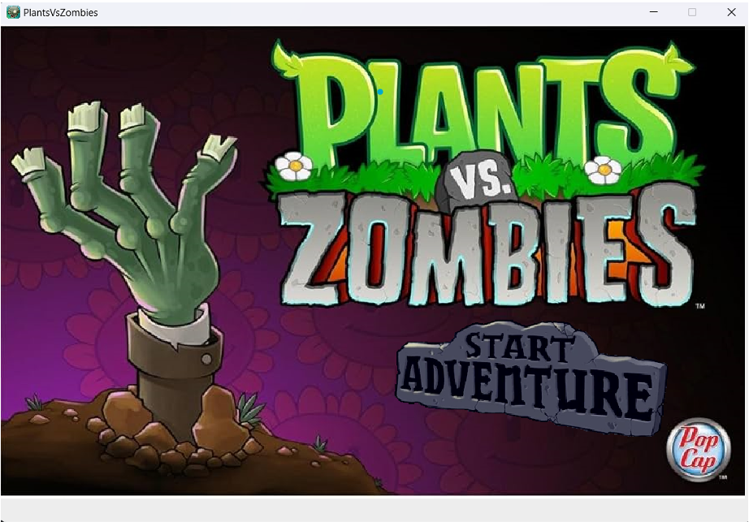
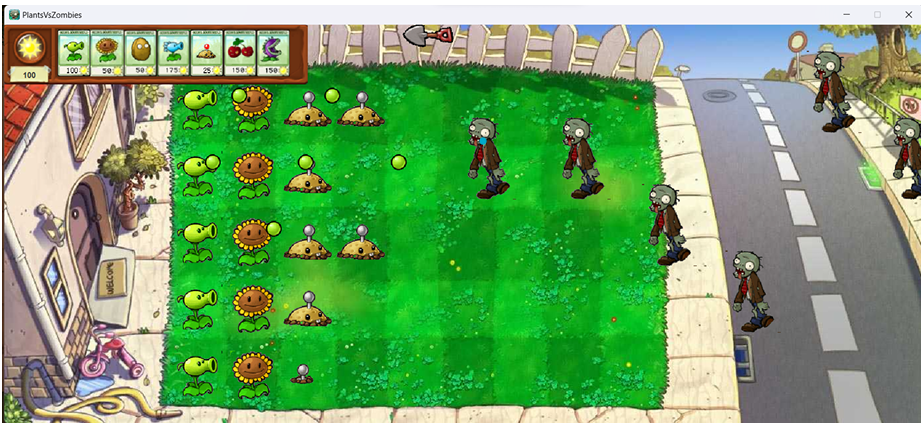

# Plant vs Zombies in City – Java OOP Project

## Project Description

This project is a Java-based clone of the famous game **"Plants vs. Zombies"**, built entirely using **Object-Oriented Programming (OOP)** principles.

### Objectives
- Practice and improve Java OOP skills: inheritance, polymorphism, encapsulation, abstraction.
- Learn real-world software design through game mechanics.
- Develop a complete, playable game with modular and scalable architecture.
- Collaborate effectively in a team using Git and task management tools.

---

## 🔧 Tools & Technologies

- **Language:** Java
- **IDE:** IntelliJ, VSCode  
- **Version Control:** Git, GitHub  
- **Graphics & Assets:** Adobe Photoshop, Pixel Studio, Pixilart  
- **Sprite Sheet Tool:** PineTools

---

## Game Mechanics

### Basic Rules

- The game is grid-based (5 rows × 9 columns).
- You plant **defensive/offensive plants** to stop zombies from reaching your house.
- Collect **sun points** to buy and place plants.
- Each wave becomes harder, and the game ends when zombies reach the house.

### Gameplay Flow

1. **Start the Game** – Receive 100 initial sun points.
2. **Plant Selection** – Choose plants with strategic consideration.
3. **Placement** – Drag & drop plants on the grid.
4. **Collect Sun** – From sunflowers or falling from the sky.
5. **Combat Zombies** – Survive incoming zombie waves.
6. **Win/Lose** – Win if all zombies are defeated, lose if any reach the house.

---

## Code Structure

### OOP Architecture

- Fully modular with packages:
  - `plant`, `zombie`, `bullet`, `game`, `ui`, `sound`, `card`, `controller`
- Each plant/zombie is an **independent class**, inheriting from base classes.
- Uses **Java Swing** for GUI and **multithreading** for animations, events.

### Game States
- `MENU`, `PLAY`, `END`, `WIN` managed via `GameWindow` & `GamePlay`.

### AI Logic
- Zombies advance row by row with varied health, speed, and defense.
- Game scales difficulty across levels and waves.

---

## Key Features

- **Grid-based combat**: Classic 5×9 layout
- **6 plant types**: Peashooter, Sunflower, WallNut, Chomper, PotatoMine, SnowPea
- **4 zombie types**: Normal, Conehead, Flag, Buckethead
- **Bullet & effect system**: Pea and SnowPea with collision detection
- **Game State Management**: Seamless transitions between play, win, and lose states
- **Sound system**: Background music and effects
- **Graphics**: Clean, cartoon-style assets and animations
